#  App de Caminhadas
O **App de Caminhadas** é uma aplicação mobile desenvolvida em **Flutter** criada para facilitar o planeamento, registo e acompanhamento de rotas de caminhada. A aplicação permite selecionar um destino de forma interativa através de um mapa, calcular métricas em tempo real (distância, tempo estimado e gasto calórico), armazenar o histórico localmente e associar fotos capturadas pela câmara a cada percurso.

---

## Índice

* [Funcionalidades e Requisitos](#-funcionalidades-e-requisitos)
* [Arquitetura e Tecnologias](#-arquitetura-e-tecnologias)
* [Estrutura do Projeto](#-estrutura-do-projeto)
* [Configuração e Instalação](#-configuração-e-instalação)
* [Como Utilizar](#-como-utilizar)
* [Configuração dos Recursos (Assets)](#-configuração-dos-recursos-assets)
* [Capturas de Ecrã (Screenshots)](#-capturas-de-ecrã-screenshots)

---

## Funcionalidades e Requisitos

### **RF001 - Tela de Apresentação (Splash Screen)**
* Exibição de ecrã inicial de boas-vindas com a identidade visual do projeto antes do carregamento da interface principal.

### **RF002 - Menu Lateral (Drawer)**
* **Navegação:** Acesso rápido ao ecrã de Splash.
* **Tema Dinâmico:** Alternância em tempo real entre o **Tema Claro (Light)** e o **Tema Escuro (Dark)**.
* **Gestão de Sessão (Sair):** Opção para encerrar e apagar localmente os dados das caminhadas registadas.

### **RF003 - Criar Nova Caminhada (Mapa Interativo)**
* **Seleção de Destino:** O utilizador clica no mapa para definir o ponto final da caminhada a partir da localização inicial.
* **RF003.1 - Cálculos de Rota em Tempo Real:**
  * Traçado da rota geográfica utilizando o serviço **OSRM (Open Source Routing Machine)**.
  * Cálculo exato da distância total em metros ($m$).
  * Estimativa do tempo de caminhada em minutos ($min$).
  * Estimativa do gasto calórico ($kcal$) com base na distância percorrida.
* **RF003.2 - Modais de Confirmação:**
  * Apresentação de um *dialog* com o resumo dos dados obtidos.
  * Campo de texto para atribuição de um título personalizado à caminhada antes do salvamento.

### **RF004 - Tela de Detalhes da Caminhada**
* Visualização detalhada de rotas gravadas com destaque no mapa para origem, destino e percurso.
* Resumo com métricas de distância, tempo e calorias.
* **RF004.1 - Integração com a Câmara:**
  * Caso a caminhada ainda não possua foto, é exibido um ícone de câmara.
  * Ao clicar no ícone, a câmara nativa do dispositivo é acionada.
  * Após a captura, a foto é gravada e passa a ser exibida tanto nos detalhes quanto no *card* correspondente na Home.

---

## Arquitetura e Tecnologias

A aplicação segue uma arquitetura modular em Flutter, separando modelos de dados, componentes de interface (UI), estilização e serviços de API.

* **[Flutter](https://flutter.dev/)** (v3.0.0+) — Framework principal de UI.
* **[Dart](https://dart.dev/)** — Linguagem de programação orientada a objetos.
* **[flutter_map](https://pub.dev/packages/flutter_map)** — Renderização de mapas baseados em azulejos (*tiles*) do OpenStreetMap.
* **[latlong2](https://pub.dev/packages/latlong2)** — Gestão e operações matemátiacas com coordenadas geográficas (Latitude/Longitude).
* **[http](https://pub.dev/packages/http)** — Comunicação REST com a API pública do OSRM.
* **[image_picker](https://pub.dev/packages/image_picker)** — Acesso e captura de imagens via câmara nativa.

---

## Estrutura do Projeto

```text
app_caminhadas/
├── assets/
│   ├── icone.png           # Ícone padrão/placeholder
│   └── prints/             # Capturas de ecrã para a documentação
│       ├── home.png
│       ├── nova_caminhada.png
│       ├── detalhes.png
│       └── dark_mode.png
├── lib/
│   ├── models/
│   │   └── ponto.dart      # Classe de modelo (Caminhada, LatLng, Métricas)
│   ├── root/
│   │   └── osrm_service.dart # Integração REST com API OSRM
│   ├── style/
│   │   ├── colors.dart     # Definição das paletas de cor
│   │   └── theme.dart      # Configurações de ThemeData (Light/Dark)
│   ├── ui/
│   │   ├── menu_drawer.dart # Componente do menu lateral
│   │   ├── rota.dart       # Ecrãs de criação e detalhes da caminhada
│   │   └── splash.dart     # Ecrã de carregamento inicial
│   └── main.dart           # Ponto de entrada, rotas e gestão de estado principal
└── pubspec.yaml            # Dependências e ficheiros de recursos

```

---

## Configuração dos Recursos (Assets)

Para garantir o correto carregamento de ícones e das imagens de documentação, certifique-se de que a secção `assets` no ficheiro `pubspec.yaml` está configurada da seguinte forma:

```yaml
flutter:
  uses-material-design: true

  assets:
    - assets/icone.png
    - assets/prints/

```

---

## Configuração e Instalação

### Pré-requisitos

* **Flutter SDK** instalado na máquina.
* **Android Studio** ou **VS Code** com extensões Flutter/Dart configuradas.
* Emulador (Android/iOS) ou dispositivo físico com permissões de câmara ativas.

### Passo a Passo

1. **Clonar o Repositório:**
```bash
git clone [https://github.com/seu-usuario/app_caminhadas.git](https://github.com/seu-usuario/app_caminhadas.git)
cd app_caminhadas

```


2. **Obter as Dependências do Projeto:**
```bash
flutter pub get

```


3. **Verificar Dispositivos Conectados:**
```bash
flutter devices

```


4. **Executar a Aplicação:**
```bash
flutter run

```


---

## Como Utilizar

1. **Ecrã Principal (Home):**
* Visualize as caminhadas já registadas em formato de *cards*.
* Toque no botão flotante `+` para registar um novo percurso.


2. **Ecrã de Nova Caminhada:**
* Toque em qualquer ponto do mapa para definir o destino.
* Visualize as estatísticas automáticas no topo do ecrã.
* Clique em **Salvar** na barra superior, preencha o título no modal e confirme.


3. **Ecrã de Detalhes:**
* Clique em qualquer *card* salvo na Home.
* Caso não haja foto, toque na área do cabeçalho com o ícone de câmara para tirar uma fotografia no local.


---

## Layout e Telas (Tema Claro)

| 1. Tela Splash | 2. Home Vazia | 3. Menu Lateral |
| :---: | :---: | :---: |
| 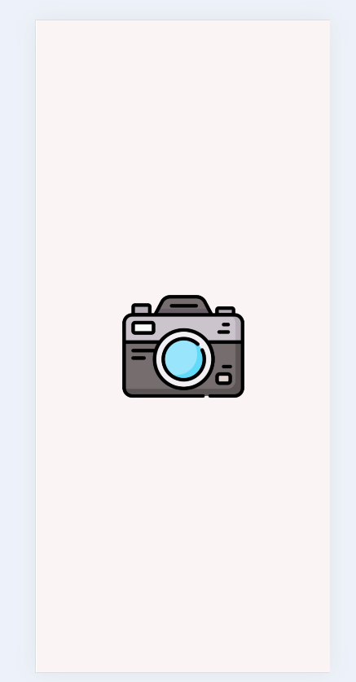 | 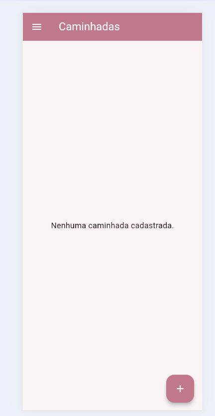 | 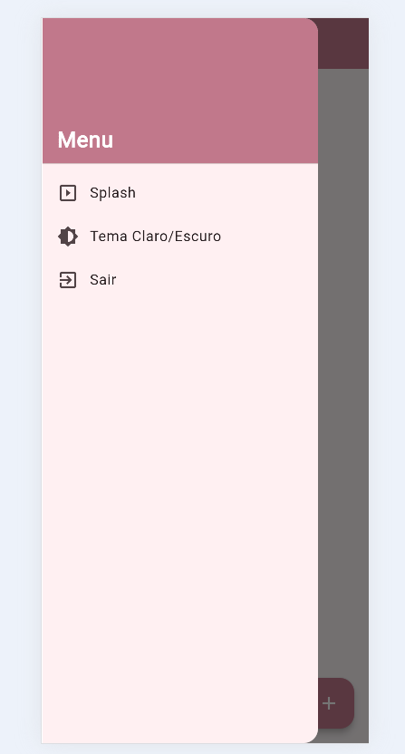 |

| 4. Cadastro Rotas | 5. Titulo | 6. Registro sem Foto |
| :---: | :---: | :---: |
| 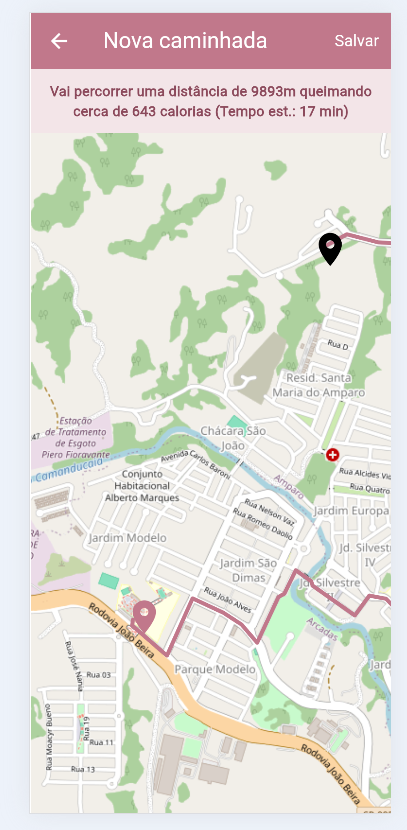 | 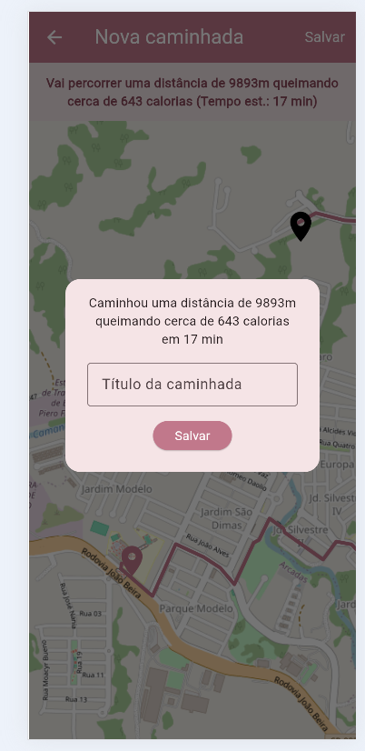 | 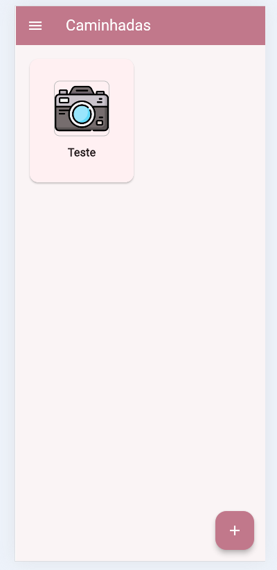 |

| 7. Cadastrar Foto| 8. Caminhada com Foto | 9. Registro com Foto |
| :---: | :---: | :---: |
| 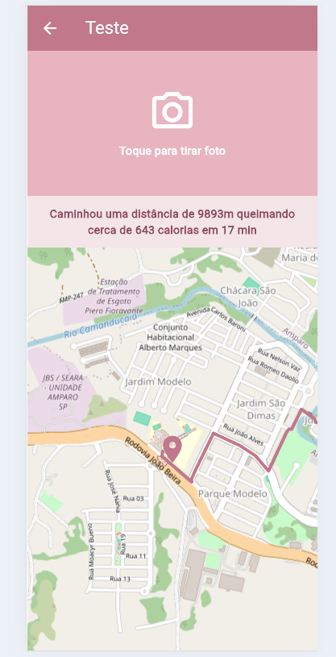 | 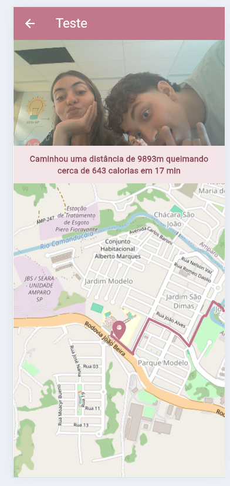 | 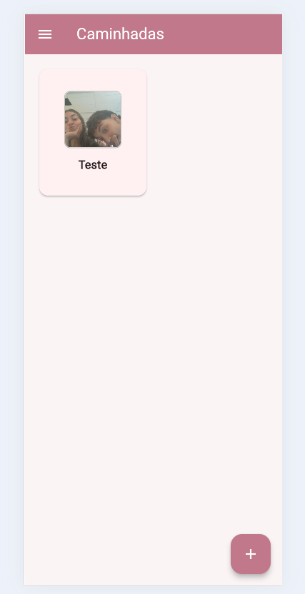 |

---

# Layout e Telas (Tema Escuro)

| 1. Tela Splash | 2. Home Vazia | 3. Menu Lateral |
| :---: | :---: | :---: |
| 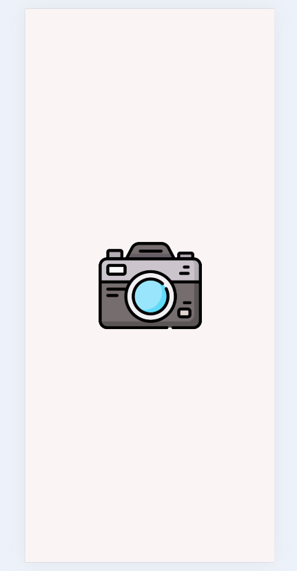 | 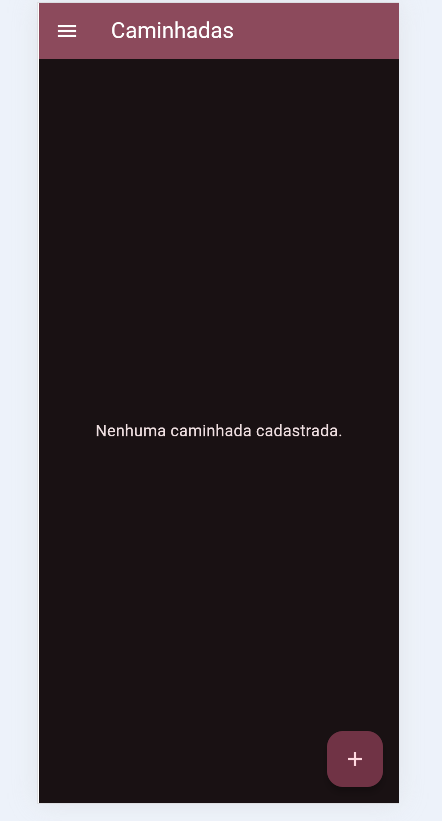 | 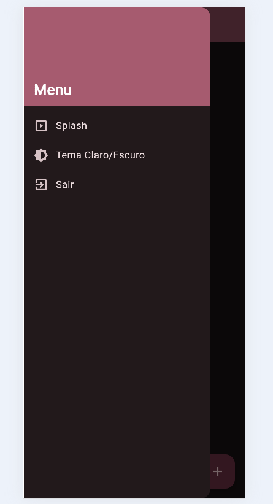 |

| 4. Cadastro Rotas | 5. Titulo | 6. Registro sem Foto |
| :---: | :---: | :---: |
| 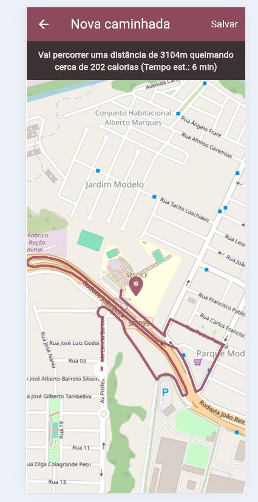 | 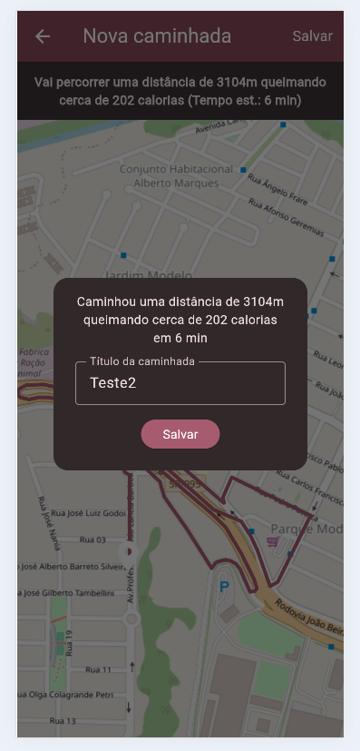 | 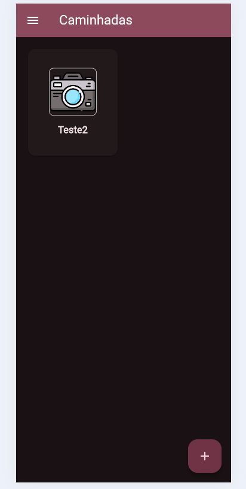 |

| 7. Cadastrar Foto| 8. Caminhada com Foto | 9. Registro com Foto |
| :---: | :---: | :---: |
| 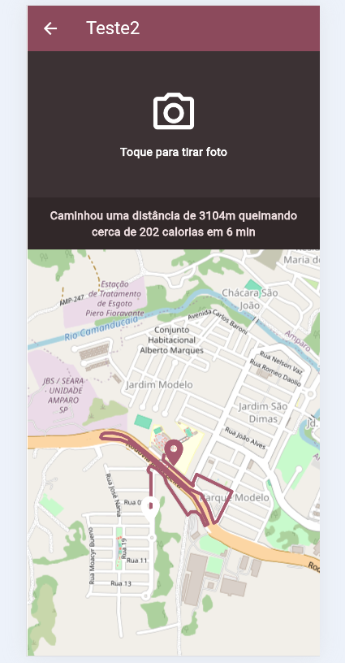 | 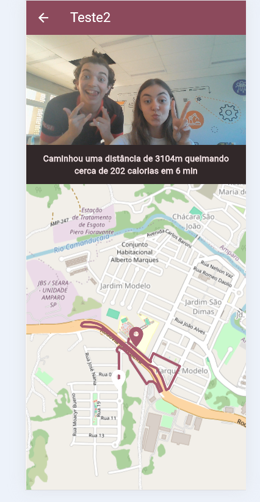 | 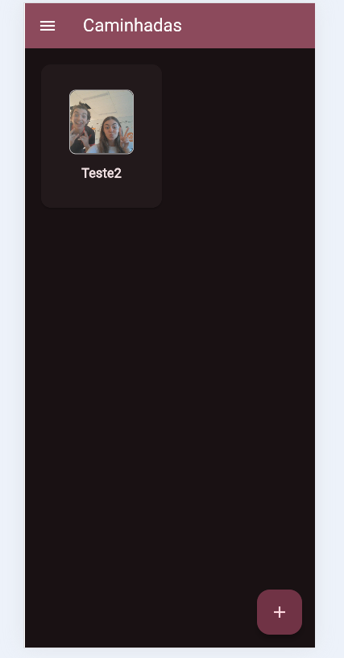 |

| 10. Mensagem de sair| 
| :---: |
| 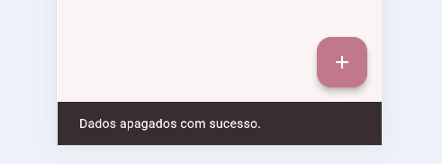 | 